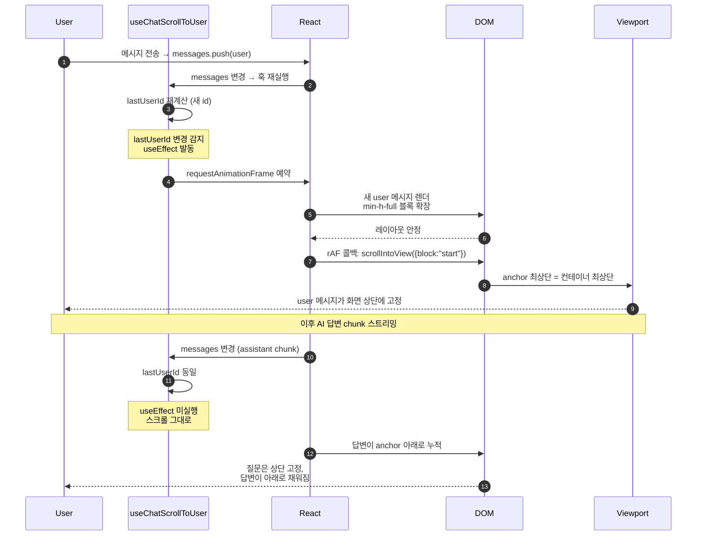

> [!NOTE] AI 챗봇 UX에서 자주 보이는 그 동작
> 메시지를 보내면 내 질문이 화면 상단에 딱 붙고, 답변이 그 아래로 흘러내리는 패턴. 단순해 보여도 막상 만들어보면 의외로 미끄러집니다. id 트리거 + `requestAnimationFrame` + `min-h-full` 세 가지가 같이 맞물려야 정확히 동작합니다.

ChatGPT나 Claude를 써보면, 메시지를 보낸 순간 내가 친 질문이 **화면 맨 위로 올라가고** 그 아래 빈 공간이 답변으로 채워지는 걸 보셨을 겁니다.

이게 왜 좋냐면, **답변을 처음부터 읽을 수 있기 때문**입니다. 일반적인 채팅 UI처럼 "새 메시지가 오면 자동으로 가장 아래로 스크롤"을 그대로 붙이면, 답변이 길어질수록 첫 줄이 위로 사라져버려서 시선이 계속 끌려 다닙니다.

직접 구현해보면 의외로 함정이 많아서, 정리해뒀습니다.

## 1. 단순한 접근이 왜 안 통하는가

처음에 떠오르는 건 이런 코드입니다.

```tsx
useEffect(() => {
  bottomRef.current?.scrollIntoView({ behavior: "smooth" });
}, [messages]);
```

문제는 **AI 응답이 스트리밍**으로 들어온다는 점입니다. 토큰 하나마다 `messages` 배열이 갱신되니까 effect가 매 chunk마다 발동돼서, 화면이 자동으로 끝까지 따라갑니다. 사용자가 위로 올려서 답변 처음 부분을 다시 읽으려고 하면 도로 아래로 끌려가요.

| 동작                 | 우리가 원하는 것      | 단순 구현 결과                |
| -------------------- | --------------------- | ----------------------------- |
| 새 user 메시지 추가  | 그 메시지로 스크롤    | OK                            |
| AI 응답 토큰 도착    | 화면 그대로 두기      | 매 토큰마다 따라감 ❌         |
| 사용자가 수동 스크롤 | 그 위치 유지          | 다음 토큰에 끌려감 ❌         |

## 2. 핵심 아이디어 — "새 user 메시지일 때만" 발동

해결책은 의외로 단순합니다. **assistant 메시지 변경은 무시하고, 새 user 메시지가 추가됐을 때만 한 번 스크롤**하면 됩니다.

이걸 구현하는 방법이 `lastUserId`라는 트리거를 만드는 것입니다. messages 배열에서 가장 최근 user 메시지의 id만 뽑아서, 그 값이 바뀔 때만 effect가 발동되게 합니다.

```tsx
const lastUserId = useMemo(() => {
  for (let i = messages.length - 1; i >= 0; i--) {
    if (messages[i]?.role === "user") return messages[i].id;
  }
  return undefined;
}, [messages]);

useEffect(() => {
  // lastUserId가 바뀔 때만 = 새 user 메시지가 들어왔을 때만
}, [lastUserId]);
```

스트리밍 중에는 assistant 메시지만 추가되니까 `lastUserId`는 그대로 → effect 미실행 → 화면 고정.

## 3. 전체 훅

```tsx
export const useChatScrollToUser = <T extends HTMLElement = HTMLDivElement>(
  messages: Array<{ id: string | number; role: string }>,
) => {
  const anchorRef = useRef<T>(null);

  const lastUserId = useMemo(() => {
    for (let i = messages.length - 1; i >= 0; i--) {
      if (messages[i]?.role === "user") return messages[i].id;
    }
    return undefined;
  }, [messages]);

  useEffect(() => {
    if (lastUserId === undefined) return;
    const id = requestAnimationFrame(() => {
      anchorRef.current?.scrollIntoView({ block: "start", behavior: "smooth" });
    });
    return () => cancelAnimationFrame(id);
  }, [lastUserId]);

  return { anchorRef };
};
```

코드 자체는 짧지만 이 안에 작은 결정 세 개가 들어 있습니다.

### 3-1. `requestAnimationFrame`이 왜 필요한가

`useEffect`는 React 커밋 직후에 실행되지만, 그 시점에 **새 user 메시지의 DOM이 아직 페인트되지 않았을 수 있습니다**. 곧바로 `scrollIntoView`를 호출하면 잘못된 위치(직전 레이아웃 기준)로 스크롤되는 케이스가 생겨요.

rAF는 다음 페인트 직전에 콜백을 실행합니다. 즉, "DOM 레이아웃이 안정된 다음 프레임"으로 한 틱 미루는 장치입니다.

### 3-2. cleanup으로 `cancelAnimationFrame`

빠른 연속 입력이나 언마운트 상황에서 예약된 rAF가 그대로 실행되면 의도치 않은 스크롤 / 메모리 누수가 생길 수 있어서, cleanup에서 취소합니다. 작지만 빠뜨리기 쉬운 부분입니다.

### 3-3. `block: "start"`

`scrollIntoView`의 디폴트는 `block: "start"`지만 명시해두는 게 좋습니다. 이게 **anchor 요소의 _최상단_ 을 스크롤 컨테이너의 _최상단_ 에 정렬**하는 옵션이라, "user 메시지를 화면 위로" 동작의 핵심이에요.

## 4. 진짜 핵심은 호출 측 레이아웃 — `min-h-full`

훅만 가지고는 동작이 완성되지 않습니다. 호출하는 쪽 레이아웃이 같이 맞아야 합니다.

```tsx
<div className="flex-1 overflow-y-auto"> {/* 스크롤 컨테이너 */}
  <div className="mx-auto flex h-full ...">
    <MessageList messages={history} /> {/* 과거 메시지들 */}

    {latest.length > 0 && (
      <div ref={anchorRef} className="min-h-full flex flex-col space-y-6">
        <MessageList messages={latest} /> {/* 최신 user + 이후 AI 답변 */}
      </div>
    )}
  </div>
</div>
```

여기서 **`min-h-full`이 빠지면 패턴 전체가 무너집니다.**

이유는 단순합니다. AI 답변이 짧으면 anchor 블록 자체도 짧아져서, **스크롤 컨테이너에 스크롤할 공간이 없습니다.** 그러면 `scrollIntoView({ block: "start" })`를 호출해도 anchor를 상단까지 끌어올릴 여유가 없어서, user 메시지가 중간 어딘가에 머무릅니다.

`min-h-full`을 주면 anchor 블록이 항상 뷰포트 1개 높이를 확보합니다. 답변이 짧든 길든 스크롤할 공간이 무조건 생기고, 그 결과 user 메시지가 정확히 상단에 박혀요.

| 조건             | min-h-full 없음      | min-h-full 있음       |
| ---------------- | -------------------- | --------------------- |
| 답변이 긴 경우   | 동작 OK              | 동작 OK               |
| 답변이 짧은 경우 | user 메시지가 중간에 | user 메시지가 상단에 ✅ |

이 한 줄이 빠져서 한참 디버깅했습니다. ~~알고 보면 별 거 아닌데 모르면 미스터리~~

## 5. 전체 흐름

세 조각이 어떻게 맞물리는지 시퀀스로 보면 이렇습니다.


1. 사용자가 메시지 전송 → `messages` 배열에 push
2. `lastUserId` 재계산 → 이전과 다른 id
3. `useEffect` 발동 → rAF 예약
4. React가 새 user 메시지를 DOM에 렌더, `min-h-full` 블록이 뷰포트만큼 확장
5. 다음 프레임에 `scrollIntoView` 실행 → user 메시지가 상단으로
6. 이후 AI 답변 chunk가 도착해도 `lastUserId`는 그대로 → effect 미실행, 화면 고정
7. 사용자는 자기 질문을 상단에 박아둔 채로 답변이 아래로 채워지는 걸 보게 됨

## 6. 정리

| 요구사항                      | 어떻게 해결했나                                     |
| ----------------------------- | --------------------------------------------------- |
| 새 user 메시지를 상단으로     | `scrollIntoView({ block: "start" })`                |
| 스트리밍 중 화면 고정         | `lastUserId`만 의존성으로 (assistant 변경에 무반응) |
| 같은 user 메시지에 재스크롤 X | `lastUserId` 동일하면 effect 미실행                 |
| 렌더 타이밍 동기화            | `requestAnimationFrame` + cleanup                   |
| 짧은 답변에도 상단 고정       | 부모에 `min-h-full`                                 |

코드 자체는 짧지만, **동작을 구성하는 결정 다섯 개가 다 살아 있어야** 의도대로 동작합니다. 특히 `min-h-full`은 훅 안에 없어서 놓치기 쉬워요.

채팅 UI 만드시는 분들에게 도움이 되길 바랍니다.

---

<details>
<summary>다이어그램 mermaid 소스 (재export용)</summary>



</details>
